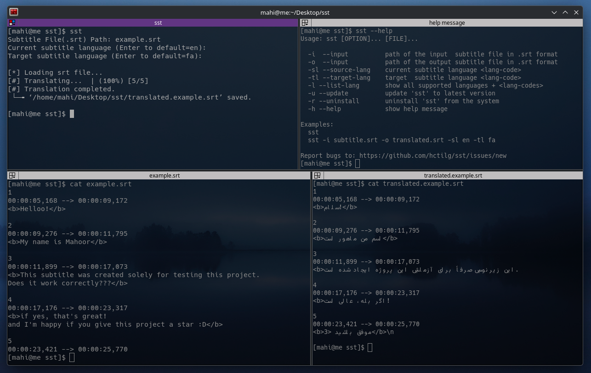

# SRT Subtitle Translation



Requirements: `curl` and `jq`

### Basic Installation

SST by running one of the following commands in your terminal.

You can install this via the command-line with either `curl` or `wget`.

#### via curl

```shell
bash -c "$(curl -fsSL https://raw.githubusercontent.com/hctilg/sst/main/install.sh)"
```

#### via wget

```shell
bash -c "$(wget https://raw.githubusercontent.com/hctilg/sst/main/install.sh -O -)"
```

## Usage

Prompts driven:
```bash
stt
```

or Arguments driven:

```bash
sst -i subtitle.srt -o translated.srt -sl en -tl fa
```